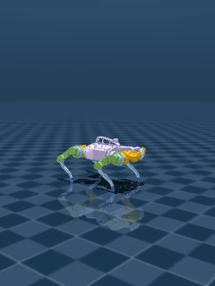
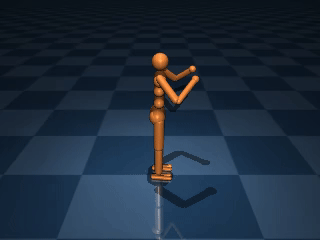
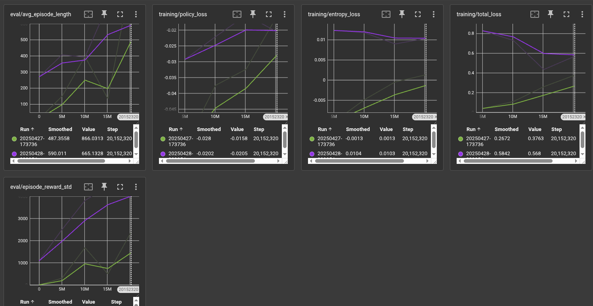
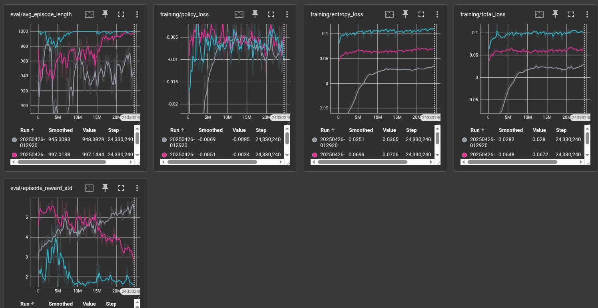

# MJX Reinforcement Learning for Locomotion

<p align="center">
  
</p>

This project focuses on training reinforcement learning (PPO) agents for simulated quadruped and humanoid locomotion tasks using the [Brax](https://github.com/google/brax) library, leveraging the [MJX](https://mujoco.readthedocs.io/en/latest/mjx.html) physics engine within MuJoCo.

## Features

- JAX-accelerated reinforcement learning for physics-based character control
- Support for quadruped and humanoid locomotion tasks
- Checkpoint management for easy experiment tracking
- Video and HTML visualization generation
- Domain randomization utilities

<p align="center">
  
</p>

## Project Structure

```
├── checkpoints/                   # Default location for saved model checkpoints
│   ├── quadruped/                 # Checkpoints for the quadruped environment
│   └── humanoid/                  # Checkpoints for the humanoid environment
├── configs/                       # Configuration files (e.g., PPO hyperparameters)
│   └── default_configs.py
├── environments/                  # Environment definitions
│   ├── __init__.py
│   ├── quadruped.py               # Quadruped environment with rewards, obs, etc.
│   └── humanoid.py                # Humanoid environment with rewards, obs, etc.
├── humanoid/                      # Humanoid MJCF model files
│   └── humanoid.xml               # Example model file
├── policies/                      # Policy training implementations
│   ├── __init__.py
│   └── ppo.py                     # PPO algorithm implementation
├── utils/                         # Utility scripts
│   ├── __init__.py
│   ├── domain_rand.py             # Domain randomization utilities
│   └── rendering.py               # Visualization tools
├── main.py                        # Main script for training and evaluation
├── README.md                      # This file
└── requirements.txt               # Dependencies
```

## Setup / Requirements

1. **Clone the repository:**
   ```bash
   git clone https://github.com/pranavreddy23/MJX_RL.git
   cd MJX_RL
   ```

2. **Virtual Environment (Recommended):**
   ```bash
   python -m venv mjx_env
   source mjx_env/bin/activate  # On Linux/macOS
   # .\mjx_env\Scripts\activate  # On Windows
   ```

3. **Install Dependencies:**
   Ensure you have a compatible version of MuJoCo installed (>3.1.0 recommended for MJX). Install the necessary Python packages:

   ```bash
   pip install "jax[cuda12_pip]" brax mujoco flax orbax-checkpoint mediapy ml_collections "etils[epath]"
   ```
   
   *(Adjust JAX version based on your CUDA setup if applicable)*

### 🧍‍♂️ Humanoid Agent Training

<p align="center">
  
</p>

### 🐾 Quadruped Agent Training

<p align="center">
  
</p>

## Usage

The main entry point is `main.py`.

### Training

- **Train Quadruped (default):**
  ```bash
  python main.py --env quadruped
  ```

- **Train Humanoid:**
  ```bash
  python main.py --env humanoid
  ```

- **Specify Checkpoint Directory:**
  ```bash
  python main.py --env quadruped --brax_checkpoint_dir /path/to/my/checkpoints
  ```

- **Resume Training:**
  Training automatically resumes from the latest checkpoint in the environment's subdirectory.

- **Resume from Specific Checkpoint:**
  ```bash
  python main.py --env quadruped --load_checkpoint ./checkpoints/quadruped/000010000000
  ```

### Evaluation

- **Evaluate Latest Quadruped Policy:**
  ```bash
  python main.py --env quadruped --eval_only
  ```

- **Evaluate Specific Checkpoint:**
  ```bash
  python main.py --env humanoid --eval_only --load_checkpoint ./checkpoints/humanoid/final_model
  ```

### Rendering

Rendering is enabled by default after training or evaluation (`--render`):
- A video (`policy_render.mp4`) will be saved
- An HTML visualization (`policy_visualization.html`) will be generated

Both files are placed in the environment's checkpoint directory.

### Command-line Arguments

Use `python main.py --help` to see all available options.

## Checkpoints

- Checkpoints are saved in subdirectories organized by environment name
- A symlink named `final_model` points to the latest successful checkpoint
- Example path: `./checkpoints/quadruped/final_model` → `./checkpoints/quadruped/000020000000`

## Acknowledgments

- [Brax team](https://github.com/google/brax) for the physics-based RL framework
- [MuJoCo team](https://mujoco.org/) for the MJX physics engine
